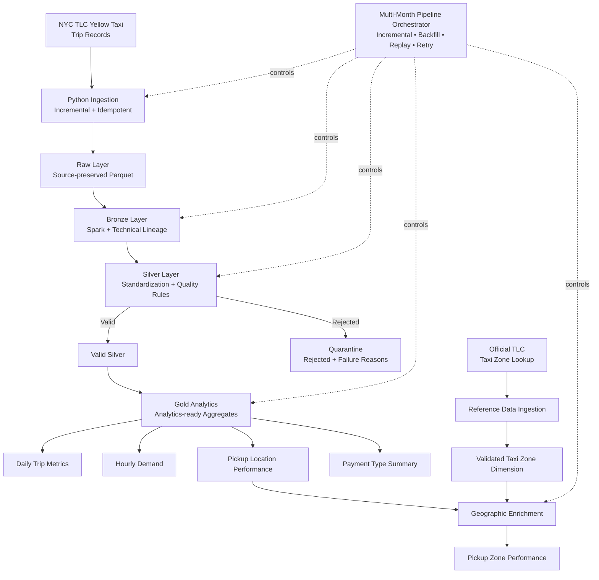
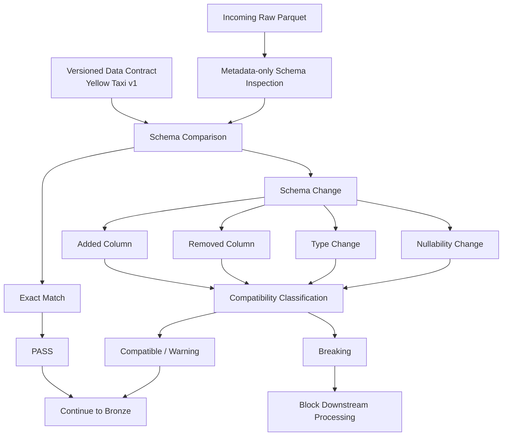
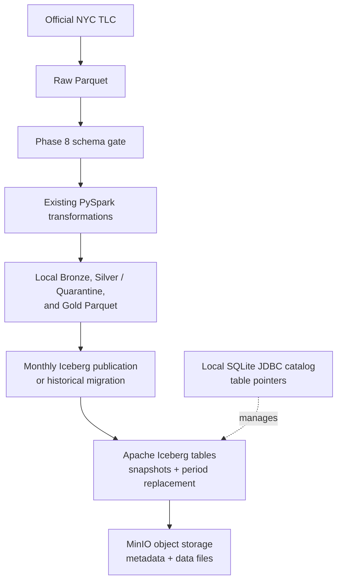
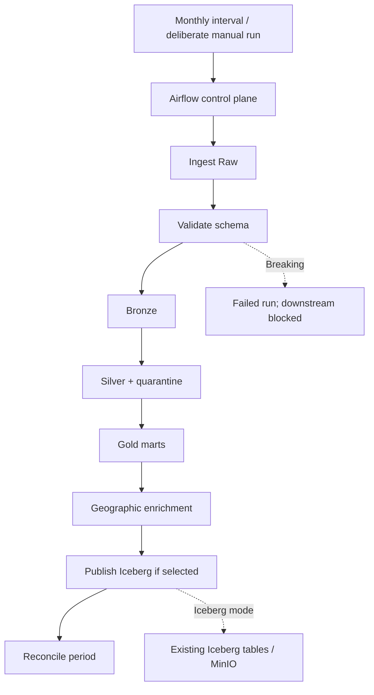

# NYC Taxi Lakehouse

A local, production-style data engineering project that incrementally builds a lakehouse for official
NYC Taxi & Limousine Commission (TLC) Yellow Taxi trip records. The project is designed to demonstrate
reproducible ingestion, Spark processing, data quality, orchestration, and analytics without requiring
paid cloud services.

## Project overview

The implemented system downloads official TLC Yellow Taxi Parquet data into a local raw layer and
creates a source-aligned Bronze Parquet partition. Future phases will add cleaned Silver data and Gold
analytics; those layers are not implemented yet.

`PROJECT_STATUS.md` records the active development state. This README is cumulative technical
documentation for functionality that has been implemented and validated.

## Architecture



The eventual local platform may add MinIO, Airflow, dbt Core, an analytics database, Superset,
data-quality checks, and CI. Kafka and Debezium are intentionally deferred until the batch pipeline is
reliable.

## Technology stack

| Component | Current use |
| --- | --- |
| Python 3.11 | Ingestion package and CLI |
| Docker Compose | Reproducible local development environment |
| Java 17 | PySpark runtime dependency |
| PySpark 3.5.3 | Local Bronze processing engine |
| PyArrow 18.1.0 | Lightweight Parquet metadata validation |
| pytest and Ruff | Automated tests and linting |
| Git and GitHub | Versioned, reviewable project history |

## Repository structure

```text
src/nyc_taxi_lakehouse/  Reusable Python package
├── ingestion/           Official TLC raw-data ingestion
├── bronze/              Source-aligned Spark Bronze processing
configs/                 Versioned, non-secret configuration
data/                    Local runtime data; generated content is ignored
tests/                   Unit and integration tests
docs/architecture/       Architecture documentation
scripts/                 Developer utilities
```

The project uses a `src/` layout so command-line jobs, tests, and future orchestration import the same
package code instead of relying on loose scripts.

## Getting started

Docker Desktop must be running. Create local configuration from the safe template, build the image, and
run the current checks:

```powershell
Copy-Item .env.example .env
docker compose build
docker compose run --rm pipeline python --version
docker compose run --rm pipeline pytest
docker compose run --rm pipeline ruff check src tests
```

The validated container environment is Python 3.11.16, OpenJDK 17.0.20.1, PySpark 3.5.3, and PyArrow
18.1.0.

## Completed: project foundation

Phase 1 established the project’s reproducible local foundation:

- Docker-based Python, Java, and PySpark environment, avoiding a host Python/Spark dependency.
- A local SparkSession smoke test that started Spark, inspected a DataFrame schema, and completed count
  and filter actions successfully.
- pytest and Ruff configuration, including a package-import test.
- `.env.example` for safe local configuration; actual `.env` is ignored and excluded from Docker build
  contexts.
- Git repository on `main`, with the project published to GitHub.

## Completed: NYC TLC Yellow Taxi ingestion

### Official source and parameterization

The ingestion module downloads official TLC-hosted monthly Yellow Taxi Parquet files. TLC publishes the
data on its [Trip Record Data page](https://www.nyc.gov/site/tlc/about/tlc-trip-record-data.page) using
this direct-file pattern:

```text
https://d37ci6vzurychx.cloudfront.net/trip-data/yellow_tripdata_<year>-<month>.parquet
```

The CLI accepts `--taxi-type`, `--year`, `--month`, `--destination-dir`, and `--force`; production logic
does not hard-code a development month. Yellow Taxi is the only enabled taxi type at this stage.

```powershell
docker compose run --rm pipeline python -m nyc_taxi_lakehouse.ingestion.nyc_taxi --year 2024 --month 1
```

### Raw-data layout and lineage

Raw source data is organized by taxi type, year, and month so each source period remains independently
addressable as later processing becomes partition-aware:

```text
data/raw/
├── yellow/2024/01/yellow_tripdata_2024-01.parquet
└── metadata/yellow/2024/01/yellow_tripdata_2024-01.json
```

For every successful download, the generated JSON manifest records the dataset, taxi type, year/month,
official source URL, local runtime path, filename, UTC download timestamp, and byte size.

### Reliable download behavior

The downloader uses Python logging, a bounded three-attempt retry strategy, HTTP error handling, and
clear exceptions for invalid requests, network failures, and filesystem errors. It writes downloads to a
`.part` file and validates it before atomically promoting it to the final filename, preventing an
interrupted download from appearing successful.

Validation confirms that the file exists, is non-empty, and exposes readable Parquet footer metadata
through PyArrow without loading the full dataset into memory.

The ingestion operation is idempotent at the source-file level: a rerun validates the final existing
Parquet file and skips the network download unless `--force` is supplied. `--force` explicitly replaces
the local file when required.

### Validated development example

Yellow Taxi `2024-01` was downloaded from the official source and validated successfully:

- File: `yellow_tripdata_2024-01.parquet`
- Raw size: 49,961,641 bytes
- Metadata manifest: generated under `data/raw/metadata/yellow/2024/01/`
- Rerun: skipped the valid existing file without re-downloading it

### Testing and Git safety

The automated test suite uses mocked network responses and tiny synthetic Parquet files; it never needs
to download the TLC dataset. Tests cover URL and path construction, invalid months, skip and force
behavior, partial-file cleanup, invalid-download rejection, and manifest generation.

Generated raw Parquet files, manifests, partial files, logs, Spark temporary output, Docker volumes,
virtual environments, and `.env` are excluded from Git. The repository contains only directory
placeholders under `data/`.

## Completed: Bronze data layer

### Purpose and source preservation

The Bronze job reads the successful raw source file with PySpark and preserves every source business
column, value, and Spark-inferred type. It deliberately performs no business cleaning, deduplication,
timestamp repair, null handling, or quality-based rejection; those responsibilities begin in Silver.

The validated `2024-01` Yellow Taxi source contains 2,964,624 rows and 19 columns:

```text
VendorID, tpep_pickup_datetime, tpep_dropoff_datetime, passenger_count,
trip_distance, RatecodeID, store_and_fwd_flag, PULocationID, DOLocationID,
payment_type, fare_amount, extra, mta_tax, tip_amount, tolls_amount,
improvement_surcharge, total_amount, congestion_surcharge, Airport_fee
```

### Bronze layout and lineage

Run the Bronze job for one raw source period with:

```powershell
docker compose run --rm pipeline python -m nyc_taxi_lakehouse.bronze.processor --taxi-type yellow --year 2024 --month 1
```

The output uses a Hive-style, month-granular layout:

```text
data/bronze/yellow/year=2024/month=01/
└── part-*.snappy.parquet
```

Year/month directories allow later partition-aware reads while avoiding high-cardinality partitions such
as trip IDs or pickup timestamps. The current approximately 50 MB development input is coalesced to one
Parquet part file to avoid a local small-file fan-out; this policy can be tuned after benchmarking at a
larger scale.

Bronze adds five technical lineage columns, separate from TLC business fields:

- `_bronze_ingested_at` — one UTC timestamp shared by the processing run
- `_source_file` — source Parquet filename
- `_source_taxi_type`
- `_source_year`
- `_source_month`

### Idempotency and safe writes

The job writes Spark output to a generated temporary sibling directory, reads it back, and validates
row preservation, source columns, lineage columns, and lineage values. Only after validation succeeds
does it replace the requested `year/month` target partition. If promotion fails, a prior target is kept
as a rollback path. A rerun replaces only the same year/month partition rather than appending duplicate
rows or touching unrelated months.

### Validated development example

Bronze was run against the existing Yellow Taxi `2024-01` raw file:

- Source: 49,961,641 bytes, 2,964,624 rows, 19 columns
- Bronze target: `data/bronze/yellow/year=2024/month=01/`
- Bronze result: 2,964,624 rows, 24 columns, 5 technical columns
- Parquet payload: 61,639,367 bytes in 1 part file
- Final validation run: approximately 24 seconds
- Idempotency rerun: retained one `month=01` partition and one part file; row count stayed 2,964,624

### Spark design notes

Spark transformations such as adding lineage columns are lazy; actions such as `count()` and writing
Parquet trigger execution. This job uses counts intentionally for operational validation and never
collects the source dataset to the driver. Spark DataFrame partitions are execution units, while the
`year=.../month=...` directories are data-layout partitions used for future pruning. PySpark is used
instead of Pandas so the same processing model can scale beyond this local monthly source.

## Engineering decisions

- **Parquet over CSV:** columnar storage supports efficient later reads through column and predicate
  pruning.
- **PySpark:** a distributed processing engine suitable for growth beyond a small local sample; it was
  validated in the local Docker environment before transformation work begins.
- **Raw-layer lineage:** a small per-file manifest is sufficient now and avoids prematurely introducing
  a metadata platform.
- **Local-first architecture:** Docker and open-source libraries keep the project reproducible and free
  to run; cloud mappings below are reference architecture, not deployed services.

## Implementation roadmap

- [x] Phase 1 — Project foundation
- [x] Phase 2 — NYC Taxi ingestion
- [x] Phase 3 — Bronze layer
- [x] Phase 4 — Silver layer
- [x] Phase 5 — Gold layer
- [x] Phase 6 — Lakehouse/object storage
- [x] Phase 7 — Containerization improvements
- [x] Phase 8 — Schema Evolution & Data Contracts
- [x] Phase 9 — MinIO + Apache Iceberg lakehouse storage
- [x] Phase 10 — Airflow Production Orchestration
- [ ] Phase 11 — Analytics database and dashboard
- [ ] Phase 12 — Testing improvements
- [ ] Phase 13 — CI/CD
- [ ] Phase 14 — Performance/scalability
- [ ] Phase 15 — Final documentation/interview preparation

## Implementation Details

### Phase 1 — Project Foundation

Phase 1 established a reproducible, local-first engineering baseline: Python 3.11, a `src/`-based
package, Docker Compose, Java 17, PySpark 3.5.3, dependency configuration, pytest, and Ruff. The
Docker image was validated with a real local SparkSession smoke test. Configuration is kept outside
source code through `.env.example`; the real `.env` is ignored by Git. The repository also includes
the initial data-layer directory scaffold and Git/GitHub setup. The `src/` layout keeps reusable
pipeline code separate from tests and scripts, while Docker makes the environment reproducible for
another developer without a host Spark installation.

### Phase 2 — NYC Taxi Ingestion

The ingestion module downloads official NYC Taxi & Limousine Commission Yellow Taxi Parquet files for
a requested year and month. The validated development example is Yellow Taxi 2024-01:
`yellow_tripdata_2024-01.parquet` (49,961,641 bytes). It is stored at
`data/raw/yellow/2024/01/`, with its lineage manifest under
`data/raw/metadata/yellow/2024/01/`.

Run one month with:

```powershell
docker compose run --rm pipeline python -m nyc_taxi_lakehouse.ingestion.nyc_taxi --year 2024 --month 1
```

The CLI constructs the official TLC URL, streams the download to a temporary `.part` file, validates
non-zero size and the Parquet footer with PyArrow, then atomically promotes the completed file.
Structured logging, HTTP/network error handling, and bounded retries make failures explicit. A valid
existing file is revalidated and skipped, which was confirmed by a second real execution. Generated
raw data and manifests are excluded from Git. Phase 2 had 9 passing automated tests.

### Phase 3 — Bronze Layer

Bronze creates a source-aligned Spark representation of each raw file: Raw Parquet → PySpark Bronze
processor → source columns preserved plus technical lineage → partitioned Bronze Parquet. For Yellow
Taxi 2024-01, the source had 2,964,624 rows, 19 columns, and 49,961,641 bytes. Bronze retained all
2,964,624 rows and source columns, added five columns, and wrote one 61,639,367-byte Snappy Parquet
part file in approximately 24 seconds.

The technical fields are `_bronze_ingested_at` (the run timestamp), `_source_file` (source filename),
`_source_taxi_type`, `_source_year`, and `_source_month`. Output uses
`data/bronze/yellow/year=2024/month=01/`; month-level partitions keep independently processable
periods small enough for partition pruning without over-partitioning. A temporary sibling write is
read back before replacing only the target partition. Reprocessing January preserved the final count
of 2,964,624 rows without creating duplicate data. Bronze intentionally does not clean business
values; that is the responsibility of Silver. Phase 3 completed with 12 passing tests and Ruff.

### Phase 4 — Silver Layer

Silver standardizes Bronze columns for analytics, preserves all Bronze lineage, adds
`_silver_processed_at`, and derives `trip_duration_minutes` and `pickup_date`. The actual TLC naming
changes are `VendorID` → `vendor_id`, `RatecodeID` → `rate_code_id`, `PULocationID` →
`pickup_location_id`, `DOLocationID` → `dropoff_location_id`, and `Airport_fee` → `airport_fee`.
Monetary fields are represented as fixed-scale decimals to avoid floating-point presentation issues.

The processor evaluates missing pickup/dropoff timestamps, invalid timestamp order, negative trip
distance, negative fare amount, negative total amount, and missing/non-positive pickup or dropoff
location IDs. Invalid records are retained in
`data/quarantine/silver/yellow/year=2024/month=01/` with an array of `_quality_failure_reasons`;
valid records are written to `data/silver/yellow/year=2024/month=01/`. The January 2024 run reconciled
2,964,624 Bronze rows into 2,927,000 valid rows (98.7309%) and 37,624 rejected rows (1.2691%). Rule
failure counts were 56 invalid timestamp orders, 37,448 negative fares, and 35,504 negative totals;
all other implemented rule counts were zero. Counts can overlap because one quarantined record may
have multiple reasons.

Run Silver with:

```powershell
docker compose run --rm pipeline python -m nyc_taxi_lakehouse.silver.processor --taxi-type yellow --year 2024 --month 1
```

Both valid and quarantine partitions are written to temporary directories, validated by Spark
read-back, and promoted together with rollback protection. A rerun produced the same counts and
replaced only the January outputs, demonstrating partition-level idempotency. The final run produced
one Silver part file (65,398,600 bytes) and one quarantine part file (897,649 bytes). Phase 4
completed with 15 passing tests and Ruff.

### Phase 5 — Gold Analytics Layer

Gold creates analytics-ready marts exclusively from the valid Silver partition; it never reads Raw,
Bronze, or quarantine data. `total_revenue` is the sum of TLC `total_amount`, documented as a
revenue-like trip-charge metric rather than company accounting revenue. Four purpose-built Parquet
datasets are produced for each taxi type/year/month:

- `daily_trip_metrics` — one row per `pickup_date`, with trip counts, total trip charges, fare/total
  averages, distance, duration, and tip metrics.
- `hourly_demand` — one row per `pickup_date` and `pickup_hour`, with trip counts, total trip charges,
  average distance, and average duration.
- `pickup_location_performance` — one row per `pickup_location_id`, with trip counts, total trip
  charges, average trip charge, distance, duration, and total tips.
- `payment_type_summary` — one row per numeric `payment_type`, with trip/revenue distribution,
  percentages, and tip metrics.

For Yellow Taxi 2024-01, 2,927,000 valid Silver trips produced 35 daily rows, 749 hourly rows, 260
pickup-location rows, and 5 payment-type rows. Each mart reconciled its `trip_count` total to the
Silver input. The local outputs contain one Snappy Parquet part file each: 6,507 bytes for daily,
22,060 bytes for hourly, 13,863 bytes for pickup location, and 3,948 bytes for payment type. Payment
trip and revenue percentages each reconciled to 100% within floating-point tolerance.

Every Gold row carries `_gold_processed_at`, `_source_taxi_type`, `_source_year`, and `_source_month`.
Gold uses temporary writes, Spark read-back validation, and coordinated replacement of all four target
partitions, so a rerun replaces only that month rather than appending duplicate aggregates. The first
January run took 49.17 seconds; a rerun retained the same results. Run the full Gold set with:

```powershell
docker compose run --rm pipeline python -m nyc_taxi_lakehouse.gold.processor --taxi-type yellow --year 2024 --month 1
```

Phase 5 completed with 18 passing tests and Ruff.

### Phase 6 — Taxi Zone Reference Data & Geographic Enrichment

Phase 6 adds the official TLC Taxi Zone Lookup as a separately managed reference dataset, enabling
location analytics to use `location_id`, `borough`, `zone`, and `service_zone` rather than only numeric
IDs. It is downloaded from the TLC-hosted
`https://d37ci6vzurychx.cloudfront.net/misc/taxi_zone_lookup.csv` endpoint into ignored local runtime
storage at `data/reference/taxi_zones/taxi_zone_lookup.csv`. A generated manifest captures source URL,
retrieval time, local path, file size, and validation outcome.

The lookup is validated as readable CSV with required columns, integer/non-null/unique `LocationID`, and
non-blank Borough and Zone values before it is used. The January validation downloaded 12,331 bytes and
found 265 rows, 265 unique IDs, zero duplicates, and zero null/blank counts for LocationID, Borough,
Zone, and service_zone. Run its independent ingestion with:

```powershell
docker compose run --rm pipeline python -m nyc_taxi_lakehouse.reference.taxi_zones
```

`pickup_zone_performance` is a new Gold mart that enriches—without replacing—the existing
`pickup_location_performance` contract. Its grain remains one row per `pickup_location_id`, with
borough, zone, and service_zone appended. The small 265-row dimension is broadcast and left-joined to
the 260-row location mart, avoiding a fact-side shuffle while preserving unmatched keys as null
geography. The job records matched/unmatched IDs and their affected trip counts rather than fabricating
an “Unknown” geography.

For Yellow Taxi 2024-01, all 260 processed location IDs matched (100%), no trips were affected by
unmatched keys, and the mart reconciled to all 2,927,000 valid Silver trips and the existing location
mart. It contains 260 rows, 14 columns, and one 18,362-byte Snappy Parquet part file at
`data/gold/pickup_zone_performance/yellow/year=2024/month=01/`. Location ID 161 enriches to Manhattan,
Midtown Center, Yellow Zone, with 141,742 trips. The first run took 16.37 seconds; a rerun safely
replaced only January with the same results. Run enrichment with:

```powershell
docker compose run --rm pipeline python -m nyc_taxi_lakehouse.gold.geographic --taxi-type yellow --year 2024 --month 1
```

Phase 6 completed with 26 passing tests and Ruff.

### Phase 7 — Multi-Month Incremental Processing & Backfill/Replay

Phase 7 adds a local, stateful orchestrator for independent monthly periods. It coordinates the
existing ingestion, Bronze, Silver, Gold, and geographic-enrichment jobs without becoming a data store.
Period state and run history are written atomically under ignored `data/state/`, recording the requested
period, mode, action, stage statuses, metrics, and completion status. A valid pre-existing January
partition was adopted as `BOOTSTRAPPED`; February through June were processed normally.

Run an incremental range with:

```powershell
docker compose run --rm pipeline python -m nyc_taxi_lakehouse.orchestration.pipeline --taxi-type yellow --start 2024-01 --end 2024-06 --mode incremental --from-stage ingestion
```

The January–June validation processed 20,332,093 Bronze rows into 20,015,099 valid Silver rows and
316,994 quarantined rows. Every month reconciled `Bronze = valid Silver + quarantine`; daily and
pickup-zone Gold trip counts also reconciled to valid Silver, with 100% Taxi Zone matches. An identical
incremental rerun completed in 4.719 seconds with all six periods skipped and no monthly Spark stages
or taxi-file downloads.

Replay is explicit and dependency-aware. For example, this reprocesses March from Silver while first
validating, but not rewriting, Raw and Bronze:

```powershell
docker compose run --rm pipeline python -m nyc_taxi_lakehouse.orchestration.pipeline --taxi-type yellow --start 2024-03 --end 2024-03 --mode replay --from-stage silver
```

The controlled March replay retained byte-identical Raw and Bronze files, then regenerated Silver,
all four Gold marts, and geographic enrichment. It finished in 177.51 seconds with 3,523,905 valid
rows, 58,723 quarantined rows, and a 100% geographic match rate. The external execution tool returned
partial output during the original February processing while the Docker container continued; the
pipeline itself subsequently completed successfully.

### Phase 8 — Schema Evolution & Data Contracts

The version-controlled Yellow Taxi v1 contract describes the 19 source columns observed in Raw
Parquet. `required` means a column must exist; `nullable` describes whether its source schema permits
null values. All 19 observed fields are physically nullable, including fields required to exist.
PyArrow reads only Parquet metadata for inspection, so schema checks do not scan trip rows.

The validator compares added, removed, type-changed, and nullability-changed fields against the
committed contract. It hashes a canonical logical schema with SHA-256; physical column order, period,
file path, and validation time do not affect the fingerprint. Compatibility uses `COMPATIBLE`,
`WARNING`, and `BREAKING`, with `BREAKING` taking precedence when several changes occur. A compatible
new nullable field can proceed; a missing required field or changed required type blocks Bronze and
downstream processing. Synthetic tests cover these cases, both nullability directions, field order,
and simultaneous changes.

The orchestrator validates Raw before any Bronze rebuild, including ingestion replays and backfills.
Downstream-only replays skip this source check. Historical Phase 7 success states remain readable and
continue to skip completed periods. Each validation writes an atomic, Git-ignored audit report under
`data/state/schema/yellow/<year>/<month>/`. The committed contract remains the expected schema; reports
record observations and never update the contract. Run a metadata-only audit with:

```powershell
docker compose run --rm pipeline python -m nyc_taxi_lakehouse.schema.validator --taxi-type yellow --start 2024-01 --end 2024-06
```

The real January–June 2024 files each had 19 fields and the same logical fingerprint,
`bb50ef4789e8c8308c722cc37849a2b7a0d7e46869a01909b69db4c7e3714ff7`. All six were exact
matches, `COMPATIBLE`, and `PASS`; no real schema evolution was observed. Final metadata checks took
0.032761–0.045336 seconds per period. Airflow has not been implemented.



### Phase 9 — MinIO + Apache Iceberg Lakehouse Storage

Phase 9 adds local S3-compatible object storage and transactional Iceberg tables without removing the
existing filesystem pipeline. Existing commands still write local Parquet by default. An explicit
`--storage-backend iceberg` on the multi-month orchestrator publishes each completed local Bronze,
Silver/quarantine, Gold, and geographic stage to Iceberg after the Phase 8 Raw schema gate. Historical
January–June outputs were migrated directly from their validated Parquet partitions, without rerunning
business transformations. The migration command checks the schema contract before any Bronze commit.



MinIO provides object storage, while Iceberg supplies table metadata, snapshots, and period-scoped
atomic table commits. Spark 3.5.3 uses the Iceberg Spark 3.5 / Scala 2.12 runtime `1.10.1`; its
bundled Hadoop 3.3.4 uses matching `hadoop-aws` and AWS SDK bundle `1.12.262` for S3A. Iceberg's
Hadoop catalog requires atomic filesystem rename, which an S3 object store does not provide, so this
local single-writer setup uses an embedded SQLite JDBC catalog at the Git-ignored
`data/state/iceberg_catalog.db`. The Iceberg warehouse is
`s3a://nyc-taxi-lakehouse/warehouse` in MinIO. MinIO credentials come from environment files;
`.env.example` contains clearly marked local-development values, and `.env` remains ignored. The API
and console are bound to localhost ports 9000 and 9001. This is a local demonstration, not a
production-ready multi-writer catalog or a managed-cloud deployment.

Tables live in the `lakehouse.nyc_taxi` namespace. Bronze, valid Silver, quarantine, and all five
Gold marts use Iceberg identity partitions on `_source_taxi_type`, `_source_year`, and `_source_month`.
This aligns with source-period backfills and exact monthly overwrite filters without partitioning by
trip timestamps or creating tiny daily partitions. Each table is committed separately: a failed
multi-table run is visible as a failed stage and can be retried, but it is **not** one cross-table
transaction. Existing source/business schemas and five Bronze lineage columns are preserved;
aggregates retain their period-level lineage. The Taxi Zone CSV remains the small authoritative
reference input for the existing broadcast enrichment.

| Iceberg table in `lakehouse.nyc_taxi` | Jan–Jun rows | Active data files |
| --- | ---: | ---: |
| `bronze_trips` | 20,332,093 | 6 |
| `silver_trips` | 20,015,099 | 6 |
| `quarantine_trips` | 316,994 | 6 |
| `gold_daily_trip_metrics` | 207 | 6 |
| `gold_hourly_demand` | 4,408 | 6 |
| `gold_pickup_location_performance` | 1,550 | 6 |
| `gold_payment_type_summary` | 31 | 6 |
| `gold_pickup_zone_performance` | 1,550 | 6 |

Every month reconciled: Bronze = valid Silver + quarantine; each Gold mart's summed trip count equals
valid Silver; migrated Gold rows matched their local Parquet counterparts in both directions. January
Bronze was loaded twice: 2,964,624 rows before and after, with a new Iceberg snapshot rather than
duplicate records. A separate real MinIO integration test replaced one synthetic month while keeping
another month intact and queried the earlier snapshot. All six migrated pickup-zone months retained
100% non-null zone matches. MinIO inspection found Iceberg metadata JSON and Parquet data objects.
The Phase 8 baseline of 52 tests grew to 61 passing tests, including Docker-based MinIO/Iceberg
write/read, replay, time travel, and breaking-contract checks; Ruff passed.

From the repository root, after copying `.env.example` to `.env`, use these commands. Historical
migration requires the earlier local Parquet outputs; a fresh clone must run the existing ingestion
and filesystem pipeline first.

```powershell
docker compose build pipeline
docker compose up -d minio minio-init
docker compose run --rm --no-deps pipeline python -m nyc_taxi_lakehouse.storage.smoke
docker compose run --rm --no-deps pipeline python -m nyc_taxi_lakehouse.storage.migrate --start 2024-01 --end 2024-06
docker compose run --rm --no-deps pipeline python -m nyc_taxi_lakehouse.storage.inspect --dataset bronze --year 2024 --month 1
docker compose run --rm --no-deps pipeline python -m nyc_taxi_lakehouse.orchestration.pipeline --taxi-type yellow --start 2024-01 --end 2024-01 --mode incremental --storage-backend iceberg
docker compose run --rm --no-deps -e RUN_ICEBERG_INTEGRATION=1 pipeline pytest
```

The bucket initializer and monthly migration are idempotent. The Iceberg-mode incremental command
adopted the already migrated January period, then a second run skipped it without a download or
transformation. The pinned community MinIO image is for loopback-only local development; review its
archived upstream and security status before considering any non-local use.

### Phase 10 — Airflow Production Orchestration

Airflow 2.10.5 adds a local operational control plane for the existing processors. Its Python 3.11
image includes the same Spark 3.5.3, Java 17, and Iceberg dependencies as the pipeline image.
`LocalExecutor` uses a dedicated PostgreSQL 16 metadata database; this is separate from the local
SQLite JDBC Iceberg catalog and MinIO's object storage. The scheduler and webserver run as a non-root
user, with logs and PostgreSQL data in Docker volumes. The idempotent initializer migrates the metadata
database, creates a development-only admin account, and makes an existing root-owned Phase 9 catalog
file writable by Airflow before dropping privileges. The existing Phase 7 CLI/orchestrator remains
available; Airflow does not use its period SUCCESS files to skip tasks or copy processing logic into
the DAG.



The single `nyc_taxi_monthly_lakehouse` DAG runs on `@monthly` in UTC. Its interval **start** selects
the source month: the February 2024 interval processes `2024-02`. A manual run can explicitly set
`period` in its run configuration for replay. The DAG starts at 2024-01-01 but is created paused, with
`catchup=False` and one active run at a time: starting Docker does not launch January–June or any
other historical backlog. An operator may deliberately trigger one period or request a bounded
backfill. The TLC publication lag is not inferred away: unpausing the current schedule before its
source file exists can produce an ingestion failure, so operators should check source availability.

The eight task IDs, in order, are `ingest_raw`, `validate_schema`, `bronze`, `silver`, `gold`,
`geographic`, `publish_iceberg`, and `validate_reconciliation`. The DAG only defines dependency,
parameters, retry policy, and logging; adapters in `src/nyc_taxi_lakehouse/orchestration/airflow_stages.py`
call the existing processors. Ingestion gets two retries for transient network failures; the
deterministic `BREAKING` schema gate gets none; later transform/storage tasks get one. `COMPATIBLE`
continues, and `WARNING` continues with a warning log. A breaking contract fails `validate_schema`
and leaves Bronze and all downstream tasks blocked. Filesystem mode skips optional publication using
Airflow skip semantics while reconciliation still runs. Iceberg mode calls the existing publisher for
all eight period-scoped tables; a retry replaces that month rather than appending duplicates. Each
table commit is atomic, but the eight publications are not one cross-table transaction.

Final reconciliation checks Bronze = valid Silver + quarantine, verifies all five Gold trip-count
sums against valid Silver, and—when selected—checks the published Iceberg period. The geographic task
returns matched/unmatched location counts and match percentage. XCom contains only small JSON-safe
period, compatibility, count, and snapshot metadata; DataFrames and Parquet content stay in storage.

After copying `.env.example` to the ignored `.env`, use the following from the repository root.
Airflow's web UI is bound to [localhost:8080](http://localhost:8080). Filesystem-only use does not
require MinIO; start `minio` and `minio-init` for Iceberg mode. The example credentials are strictly
for local development.

```powershell
docker compose --profile airflow build pipeline airflow-init
docker compose --profile airflow up -d airflow-postgres airflow-scheduler airflow-webserver
docker compose --profile airflow ps
docker compose --profile airflow run --rm --no-deps --user airflow airflow-init airflow dags list
docker compose --profile airflow run --rm --no-deps --user airflow airflow-init airflow dags list-runs -d nyc_taxi_monthly_lakehouse
docker compose up -d minio minio-init
docker compose --profile airflow run --rm --no-deps --user airflow airflow-init airflow dags backfill nyc_taxi_monthly_lakehouse --start-date 2024-03-01 --end-date 2024-03-01 --dry-run
docker compose --profile airflow stop airflow-scheduler airflow-webserver airflow-postgres
```

For a deliberate March replay, set `period` to `2024-03` and choose `taxi_type=yellow` and
`storage_backend=filesystem` or `iceberg` in a manual DAG run; unpause the DAG only when ready for
the scheduler to execute it. This reprocesses only the addressed month but executes all DAG stages.
The Airflow 2.10.5 CLI accepts the following manual trigger (syntax verified with its CLI help; this
real data-changing replay was **not** executed during Phase 10):

```powershell
$runConfig = '{"period":"2024-03","taxi_type":"yellow","storage_backend":"filesystem"}'
docker compose --profile airflow run --rm --no-deps --user airflow airflow-init airflow dags unpause nyc_taxi_monthly_lakehouse
docker compose --profile airflow run --rm --no-deps --user airflow airflow-init airflow dags trigger nyc_taxi_monthly_lakehouse --exec-date 2024-03-01 --conf $runConfig
```

Unpausing also enables the latest scheduled interval, so review source availability and pause the
DAG again after the controlled replay if ongoing scheduling is not desired.
The existing Phase 7 CLI remains the narrower option for a Silver-onward replay. A bounded Airflow
backfill can use the same `backfill` command without `--dry-run` **only after** reviewing the source
scope and expected overwrites. We validated March's dry-run, not a real historical Airflow backfill.

Operational evidence: PostgreSQL, MinIO, scheduler, and webserver health checks passed; Airflow
reported zero DAG import errors and listed the DAG as paused. Safe `dag.test()` runs with isolated
stage stubs recorded task-level success, optional-publication skip, and a failed schema gate with
Bronze `upstream_failed`. The final Docker suite passed **76 tests in 100.06 seconds**, including
the Phase 9 MinIO/Iceberg integration tests; Ruff passed. An existing January Iceberg Bronze table
remained readable after the Compose changes (20,332,093 total rows; 2,964,624 for January). No
January–June business transformations were rerun merely to demonstrate Airflow.

## Production mapping (reference only)

| Local component | Typical managed equivalent |
| --- | --- |
| MinIO (planned) | Amazon S3 / Azure Data Lake Storage |
| Local Spark | Amazon EMR / Databricks / Azure Synapse |
| Apache Airflow (planned) | MWAA / Cloud Composer / managed Airflow |
| Local analytics database (planned) | A cloud warehouse or managed PostgreSQL |
