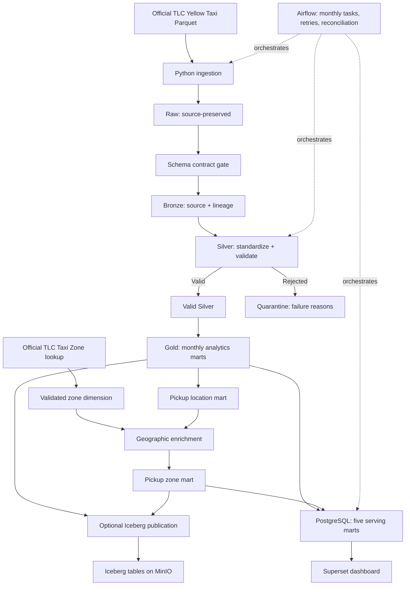

# NYC Taxi Lakehouse

A local batch lakehouse for official [NYC TLC Yellow Taxi trips](https://www.nyc.gov/site/tlc/about/tlc-trip-record-data.page). It turns monthly source files into quality-checked, analytics-ready data: PySpark preserves and validates the trips, Iceberg on MinIO provides a transactional lakehouse publication path, and PostgreSQL serves compact marts to Superset. Airflow coordinates the stages; automated tests and GitHub Actions check failure handling and correctness. No paid cloud account is required.

## What this project demonstrates

| Concern | Implemented approach |
| --- | --- |
| Incremental processing | Monthly source periods, completed-period skip, bounded backfill, explicit stage replay |
| Data contracts and quality | Metadata-only source schema gate before Bronze; row-level Silver rules and quarantine after Bronze |
| Lakehouse storage | Local Parquet by default; optional period-scoped Iceberg snapshots in MinIO |
| Operational reliability | Safe partial downloads and partition promotion, task failure propagation, reconciliation, transactional serving publication |
| Analytics | Five Gold marts, PostgreSQL serving, ten-chart Superset dashboard |
| Validation | Local 155-test full regression, four GitHub Actions CI jobs, measured performance experiments |

## Architecture



Raw retains downloaded files; Bronze preserves source business columns and adds lineage; Silver creates valid and quarantined partitions; Gold aggregates **only valid Silver**. The optional Iceberg path publishes validated local outputs to MinIO—MinIO stores objects while Iceberg manages table snapshots. Airflow and the CLI orchestrator control work; neither is a business-data store. The five Gold marts are daily trips, hourly demand, pickup-location performance, payment-type summary, and zone-enriched pickup performance. The complete [stage-by-stage record](docs/implementation-history.md) explains how the system evolved.

## Dataset and scale

Six months of Yellow Taxi source data (`2024-01` through `2024-06`) were processed locally. The official monthly Parquet files and Taxi Zone CSV are downloaded by code, not committed to Git.

| January–June 2024 | Rows |
| --- | ---: |
| Bronze source-aligned trips | 20,332,093 |
| Valid Silver trips | 20,015,099 |
| Quarantined trips | 316,994 |

Every month satisfies **Bronze = valid Silver + quarantine**. Each Gold and PostgreSQL mart's summed trip count reconciles to valid Silver for its source period. These are measured local results, not an enterprise-scale or live-streaming claim. TLC `total_amount` is used as a trip-charge/revenue-like metric, not as company accounting revenue. See [validation evidence](PROJECT_STATUS.md) for monthly and downstream checks.

## Engineering highlights

- **Period-level idempotency:** a valid raw file is re-used; completed monthly periods skip work; replay replaces only requested source-month partitions. Temporary local writes are read back before promotion, preserving prior outputs on failure.
- **Two different quality boundaries:** the versioned 19-column source contract detects structural changes using Parquet metadata **before Bronze**; Silver's eight business rules classify individual records **after Bronze**. Breaking contracts stop processing; rejected rows retain all failure reasons rather than disappearing.
- **Reference enrichment:** the authoritative TLC Taxi Zone CSV is key-validated and broadcast-joined to location aggregates. Unmatched location IDs remain visible and are counted rather than assigned invented geography.
- **Publication semantics:** Iceberg replaces source periods table by table with snapshots; its eight tables do **not** share a cross-table transaction. PostgreSQL replaces all five small serving marts for one period in **one** transaction, with value and count checks before commit.
- **Orchestration:** a stateful CLI supports incremental, backfill, and stage-scoped replay. The paused-by-default monthly Airflow DAG calls the same processors in nine visible tasks; a failure blocks dependent tasks. XCom carries metadata, not trip data.

## Data quality and reliability

Silver rejects missing pickup/dropoff timestamps, reversed timestamp order, negative distance/fare/total amounts, and missing or non-positive pickup/dropoff location IDs. Zero-distance trips and null passenger counts are not rejected solely for those values. January 2024 reconciled 2,964,624 Bronze rows into 2,927,000 valid and 37,624 quarantined rows; rule counts can overlap because one trip may fail several rules.

Operational checks cover download interruption, breaking schema, local partition-write failure, unavailable MinIO, failed Iceberg commit, failed PostgreSQL publication, and reconciliation drift. An Iceberg failure leaves the prior committed snapshot readable and does not silently fall back to filesystem mode. A serving insert failure rolls back all five marts for that source period. Isolated fault-injection tests verify recovery without rewriting historical January–June files; [details and caveats](docs/implementation-history.md) are available for deeper review.

## Analytics and dashboard

Gold Parquet is the source for the five PostgreSQL serving marts; Superset queries PostgreSQL, not trip-level Raw or Silver. The `NYC Urban Mobility Overview` dashboard has ten saved charts: four KPIs followed by paired daily demand/borough, hourly demand/top-zone, and daily amount/payment views. Its native month and scoped borough filters, light theme, layout, and styling are reproducible through an idempotent REST bootstrap. The two daily trends display pickup dates in January–June 2024 so source-date outliers do not flatten the time axis; this display window does not alter the stored marts or KPI totals. All ten chart-data calls returned data, and a signed-in local browser check showed all ten charts; “Top Pickup Zones” displayed a non-fatal row-limit warning. Example analytical queries are in [serving_examples.sql](sql/serving_examples.sql). There is no claim of real-time analytics.

## Performance engineering

For the **January 2024 Gold workload**, persisted Silver input took a **59.92 s median** versus **36.36 s** after removing persistence from production code: an observed **39.31% lower local median**. The three measured production runs were 37.296, 36.362, and 33.899 seconds. This is a single-machine Docker result with warm/mixed caches and separate similarly warmed sessions; it is workload-specific, not a general claim that caching hurts Spark. Business-value digests, geography, Iceberg/serving publication, and recovery checks matched after the change.

Other measured candidates were rejected: changing shuffle partitions lacked a reliable gain; two-file Silver repartitioning was slower and larger; an additional PostgreSQL index saved only 0.368 ms on a 1,550-row mart. Existing Iceberg January filtering already reduced planned scan tasks from six to one, and the small Taxi Zone dimension already used a broadcast join. [Experiment runs, plans, and decisions](docs/implementation-history.md#phase-14--measured-performance-work) preserve the evidence without presenting microbenchmarks as universal speedups.

## Testing and CI

The complete local Docker regression passed **155 tests** after the Phase 14 change, including heavy service/recovery checks. The [`CI` workflow](.github/workflows/ci.yml) runs on pushes to `main` and pull requests:

| Job | Gate |
| --- | --- |
| Quality | Ruff, workflow YAML, Bash syntax, Compose configuration, Git hygiene and whitespace |
| Fast Tests | Service-independent unit/contract/dashboard-definition tests on Python 3.11 and Java 17 |
| Docker Build | Builds the pipeline image; does not publish it |
| Integration Tests | Fresh MinIO/PostgreSQL, real Airflow DAG, Iceberg and serving tests without historical TLC data |

CI is **validation, not deployment**. Full-data benchmarks, two heavy tests, Superset bootstrap, and browser visual checks are local/manual rather than PR gates. The [latest completed CI evidence before this documentation update](https://github.com/harshitha-108/nyc-taxi-lakehouse/actions/runs/35905605539) passed all four jobs.

## Run locally

Use Docker Desktop with Docker Compose. The pipeline image supplies **Python 3.11, Java 17, PySpark 3.5.3, and pinned Python dependencies** from `requirements.txt`; no host Spark install is needed. Commands below use PowerShell from the repository root. `.env.example` contains **local-development-only** placeholder credentials. Copy it to an ignored `.env`, change passwords if exposing services beyond localhost, and never commit it.

### Quick validation — no NYC download or running services

```powershell
git clone https://github.com/harshitha-108/nyc-taxi-lakehouse.git
Set-Location nyc-taxi-lakehouse
Copy-Item .env.example .env
docker compose build pipeline
docker compose run --rm --no-deps pipeline python --version
docker compose run --rm --no-deps pipeline pytest -p no:cacheprovider -m "not docker and not heavy" -q
docker compose run --rm --no-deps pipeline ruff check src tests airflow scripts
```

This validates installed dependencies and runs synthetic/local-data tests without MinIO, PostgreSQL, Airflow state, Superset state, or historical TLC files. It is a **quick code/environment check**, not a claim that the six-month data pipeline ran on a fresh clone.

### One real source month — downloads and transforms millions of trips

From that same repository root, the following **non-quick** path fetches official January 2024 data and the small Taxi Zone lookup, then runs Raw → schema gate → Bronze → Silver/quarantine → all five Gold marts on the local filesystem. It needs network access and disk space; rerunning incrementally skips a complete period.

```powershell
docker compose run --rm --no-deps pipeline python -m nyc_taxi_lakehouse.orchestration.pipeline --taxi-type yellow --start 2024-01 --end 2024-01 --mode incremental --storage-backend filesystem
```

For the optional lakehouse/serving/dashboard path **after Gold exists**, start local services and publish the same month. This path uses local development credentials and does not deploy to a cloud account:

```powershell
docker compose up -d minio minio-init
docker compose --profile airflow up -d airflow-postgres
docker compose --profile airflow run --rm analytics-db-init
docker compose run --rm --no-deps pipeline python -m nyc_taxi_lakehouse.storage.migrate --start 2024-01 --end 2024-01
docker compose --profile airflow run --rm --no-deps pipeline python -m nyc_taxi_lakehouse.serving.publisher --taxi-type yellow --start 2024-01 --end 2024-01
docker compose --profile airflow --profile dashboard up -d superset
docker compose --profile airflow --profile dashboard run --rm --no-deps pipeline python scripts/bootstrap_dashboard.py
docker compose --profile airflow --profile dashboard run --rm --no-deps pipeline python -m scripts.smoke_dashboard
```

Airflow's UI is at [localhost:8080](http://localhost:8080) **after** starting `airflow-scheduler` and `airflow-webserver` with the `airflow` Compose profile; the DAG is paused at creation. Superset's UI is at [localhost:8088](http://localhost:8088) after the dashboard commands. Consult [development history](docs/implementation-history.md#phase-10--airflow-control-plane) and [current status](PROJECT_STATUS.md) for bounded replay/backfill, full service tests, and operational caveats. Do not unpause Airflow until you intend to run a source period and have checked TLC publication availability.

## Project structure

```text
src/nyc_taxi_lakehouse/   Ingestion, Bronze/Silver/Gold, schema, orchestration, storage, serving
airflow/dags/              Monthly Airflow control-plane DAG
configs/contracts/         Versioned source schema contract
scripts/                   Initialization, dashboard, benchmark, validation utilities
sql/                       Read-only serving query examples
tests/unit/                Deterministic unit and contract tests
tests/integration/         Spark, service and failure-recovery tests
.github/workflows/         Four-job CI workflow
data/                      Ignored runtime layers and state; only .gitkeep files tracked
docs/                      Technical development history
```

## Development history

[Phase 1–14 implementation and validation details](docs/implementation-history.md) retain the technical trail without making it the first thing a reader must navigate. The engineering milestones were foundation, TLC ingestion, Bronze, Silver, Gold, Taxi Zone enrichment, incremental replay, schema contracts, MinIO/Iceberg, Airflow, PostgreSQL/Superset, failure recovery, CI, and measured performance work. `PROJECT_STATUS.md` records the latest checkpoint and granular evidence.

## Limitations and production mapping

This is a local single-machine demonstration, **not** a hardened or managed-cloud deployment. The SQLite Iceberg JDBC catalog is single-writer; Iceberg commits are per table, whereas PostgreSQL serving publication is transactional across five marts per period. The pinned community MinIO image and development credentials are for loopback-only use. Airflow's paused schedule must account for TLC release lag. Superset's local setup lacks production rate limiting/CSP; the zone chart has a row-limit warning and browser visual regression is manual. Full historical data and performance runs are excluded from CI, and the measured Gold improvement does not establish performance at larger scale.

If deployed elsewhere, MinIO could map to S3/ADLS, local Spark to managed Spark, local Airflow to managed Airflow, and local PostgreSQL/Superset to appropriate managed serving/BI services. Those are **reference mappings**, not services used by this repository. Kafka, CDC, and dbt are not implemented.
