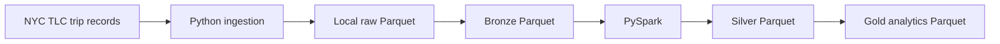

# NYC Taxi Lakehouse

A local, production-style data engineering project being built to process official NYC Taxi &
Limousine Commission (TLC) Yellow Taxi trip records through Bronze, Silver, and Gold layers.

## Current status

**Phase 2 — NYC TLC Yellow Taxi ingestion** is complete. The first processing milestone will add
Bronze, Silver, and Gold layers after raw ingestion is established:



The eventual local platform will add MinIO, Airflow, dbt Core, an analytics database, Superset,
data-quality checks, and CI. Kafka and Debezium are intentionally deferred until the batch pipeline
is reliable.

## Why this architecture

- **Parquet** is a compressed, columnar format that enables column and predicate pruning.
- **Bronze/Silver/Gold** separates source preservation, trustworthy conformed data, and business-ready
  analytics. Invalid records will be quarantined rather than silently discarded.
- **PySpark** provides a scalable execution model that remains appropriate as the project grows from a
  sample to multiple months of TLC data.
- **Docker** makes the project reproducible on this machine without requiring a host Python install.

## Repository layout

```text
src/nyc_taxi_lakehouse/  Python package; ingestion and Spark jobs will live here
configs/                 Versioned, non-secret runtime configuration
data/                    Local runtime data (large files are ignored by Git)
tests/                   Unit and integration tests
docs/architecture/       Architecture decisions and diagrams
scripts/                 Developer entry points and utilities
```

This intentionally uses a `src/` package instead of loose top-level scripts: imports, tests, and
future Airflow tasks use the same code as the command-line pipeline.

## Local setup

Docker Desktop must be running. Create your local configuration, then build the development image:

```powershell
Copy-Item .env.example .env
docker compose build
docker compose run --rm pipeline python --version
docker compose run --rm pipeline pytest
docker compose run --rm pipeline ruff check src tests
```

## Phase 2: NYC TLC raw-data ingestion

The ingestion CLI downloads one official TLC-hosted Yellow Taxi Parquet file, validates its Parquet
footer metadata without loading the dataset into memory, and writes a small lineage manifest. TLC's
official [Trip Record Data page](https://www.nyc.gov/site/tlc/about/tlc-trip-record-data.page) publishes
monthly Parquet files through this URL pattern:

```text
https://d37ci6vzurychx.cloudfront.net/trip-data/yellow_tripdata_<year>-<month>.parquet
```

Download a month with:

```powershell
docker compose run --rm pipeline python -m nyc_taxi_lakehouse.ingestion.nyc_taxi --year 2024 --month 1
```

Use `--force` only when an existing local file should be replaced. By default, the command validates
an existing local Parquet file and skips a valid file, making reruns idempotent. Downloads are written
to a `.part` file and promoted to the final name only after validation succeeds.

Raw data is organized by taxi type, year, and month:

```text
data/raw/
├── yellow/2024/01/yellow_tripdata_2024-01.parquet
└── metadata/yellow/2024/01/yellow_tripdata_2024-01.json
```

The generated manifest records the requested dataset, source URL, period, filename, local runtime
path, UTC download time, and byte size. Raw Parquet files, manifests, and partial downloads are all
excluded from Git.

## Roadmap

1. Repository and development environment
2. Download one official TLC file into local raw storage
3. Bronze, Silver, and Gold PySpark pipeline with quarantine and metrics
4. Local MinIO lakehouse storage, Docker services, Airflow, dbt, quality checks, analytics, tests, and CI

## Production mapping (planned, not deployed)

| Local component | Typical managed equivalent |
| --- | --- |
| MinIO | Amazon S3 / Azure Data Lake Storage |
| Local Spark | Amazon EMR / Databricks / Azure Synapse |
| Apache Airflow | MWAA / Cloud Composer / managed Airflow |
| Local analytics database | A cloud warehouse or managed PostgreSQL |
